# AIAnimation GPU渲染环境详细配置

# The Current Progress / 当前进度

- Unity初级编程 - 中级编程 / √
- 动画系统demo实践 完成模型导入-> 动画绑定 -> 状态机组织动画 / √
- 工具 fbx -> motiondate -> 中间数据 -> 模型训练 / ing
- ue4状态机 + AI + 行为树 / Waiting
- 着手AIAnimation框架，着手动画系统的改写 / Waiting

# Cuda and CunNN 安装与配置

- 检查 NVIDIA 显卡
- 安装 Cuda
- 安装 CuDNN
- 配置环境变量

## 检查 NVIDIA 显卡

> 电脑显卡必须为NVIDIA显卡，否则无法安装CUDA，CUDA仅为NVIDA提供的面向编程的加速库

- **cmd 命令行中输入 nvidia-smi 检查**

> CUDA Version 为 NVIDIA 支持的最高 CUDA 版本，这里里以 v11.0 为例
>
> `注意:`
>
> 1. 仅在安装了 NVIDIA 显卡驱动后，该命令才会有效，若未安装，自行安装


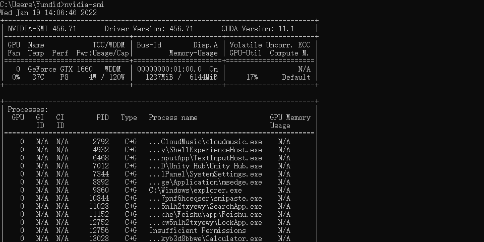

## Cuda 安装

> 以 tensorflow_gpu-2.4.0 - python 3.6.2 - CUDA 11.0 - cuDNN 8.0 为例
>
> `注意:`
>
> 1. cuda 安装时仍使用C盘默认路径，避免路径错误

- **搜索 nvidia developer，进入官网，并进入下载页面**

- **CUDA Toolkit -> LEARN MORE -> Download Now**

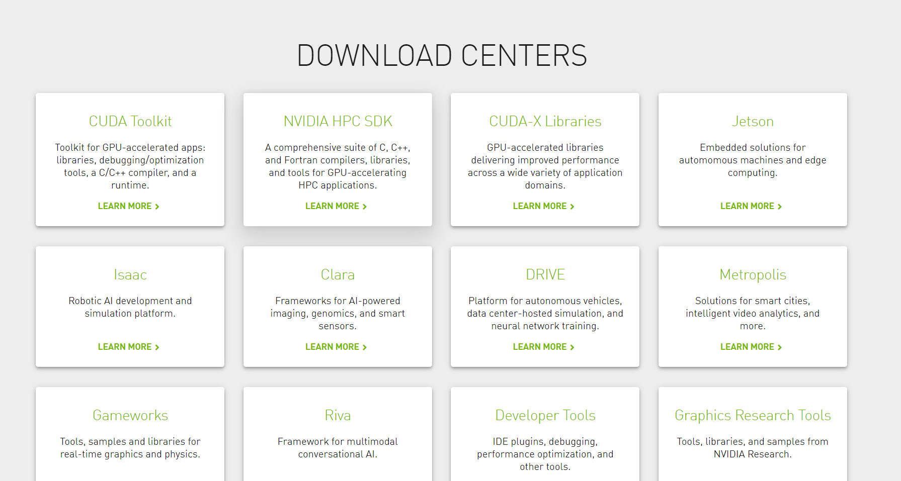

- **Resources 下 点击 Archive of Previous CUDA Releases 下载指定版本**

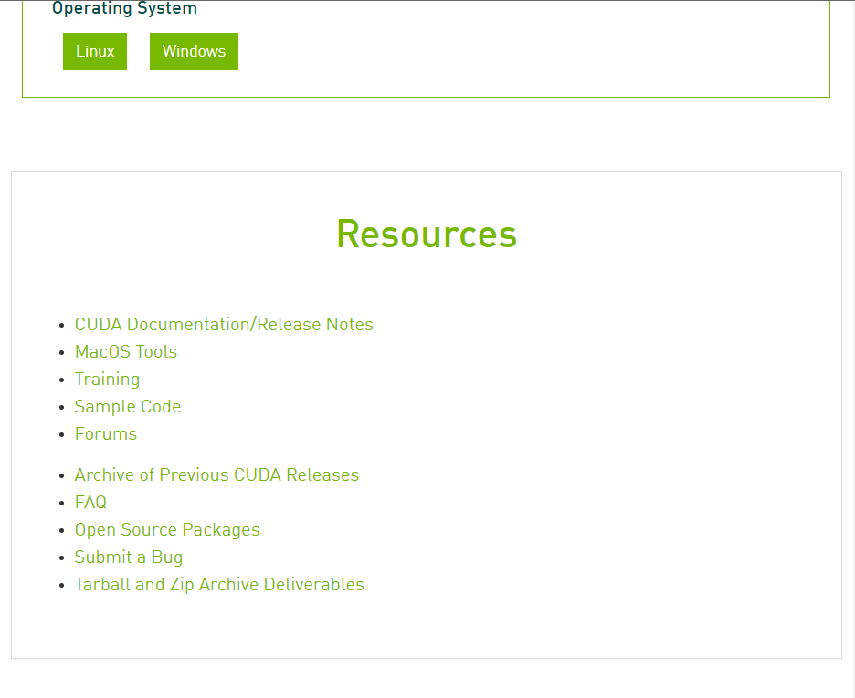

- **选择其中任一版本进行安装 Windows -> x86_64 -> 10 -> exe[local]**

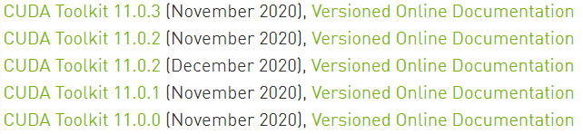

- **关闭所有安全软件，进入安装程序，选择默认路径进行自定义安装**

`注意:`

1. NVIDIA GetForce... 组件 可以去除
2. 若安装失败，可能由于未安装配置VS，可以去除 CUDA -> Documentation -> Visual Studio Integration 组件
3. 若安装失败，可能由于 CUDA自带的NVIDIA驱动版本是小于你电脑已有的版本，需要去除 Driver components -> Display Driver 组件

## CuDNN 安装

> cuDNN的全称为NVIDIA CUDA® Deep Neural Network library，是NVIDIA专门针对深度神经网络（Deep Neural Networks）中的基础操作而设计基于GPU的加速库。cuDNN为深度神经网络中的标准流程提供了高度优化的实现方式，并通过调用cuda显卡驱动实现

- **搜素 cuDNN Archive 进入官网下载，需要注册账号**

- **下载该版本即可**


## 环境变量配置

- 下载后解压，将文件里面的cuda文件重命名为cudnn，然后整个复制到 C:\Program Files\NVIDIA GPU Computing Toolkit\CUDA\v11.0 中，同时需要将重命名后的cudnn文件夹的bin里面的 cudnn64_7.dll 复制到 C:\Program Files\NVIDIA GPU Computing Toolkit\CUDA\v11.0\bin 中
- 将 cudnn 中 bin，include，lib 文件夹中的所有文件复制到 C:\Program Files\NVIDIA GPU Computing Toolkit\CUDA\v11.0 下对应的文件夹中
- 将 C:\Program Files\NVIDIA GPU Computing Toolkit\CUDA\v11.0\cudnn\bin 添加至系统环境变量中
- 将 C:\Program Files\NVIDIA GPU Computing Toolkit\CUDA\v11.0\extras\CUPTI\lib64 添加至系统环境变量中
- 并将前两步添加的环境变量上移至前面两个变量（在安装过程中系统已经自动配置的）路径之下

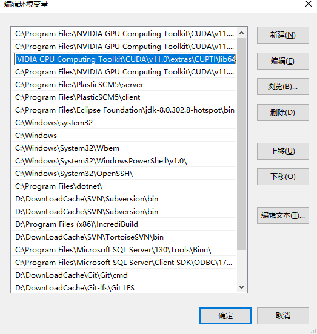

## 测试 Cuda 是否安装成功

> cmd 命令行中输入 nvcc -V，若出现以下信息，则成功

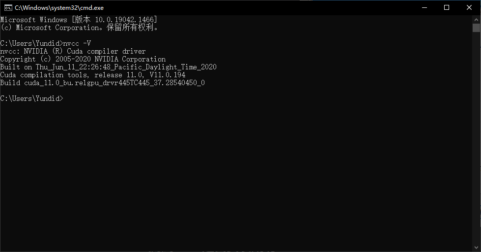

# Tensorflow 环境安装

- Anaconda 安装
- Tensorflow_env 环境搭建
- Tensorflow 版本升级
- pycharm 环境配置

## Anaconda 安装

>  www.anaconda.com 安装最新版本即可.

1. 自定安装时使用c盘默认路径即可，若更改，环境配置时可能出现跨磁盘的路径错误

   

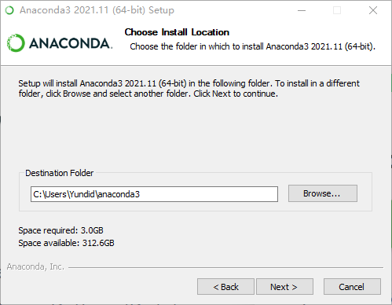

2. 勾选 Add PATH
3. 完成安装

## Tensorflow_env 环境搭建

- **打开 Prompt 命令行工具**

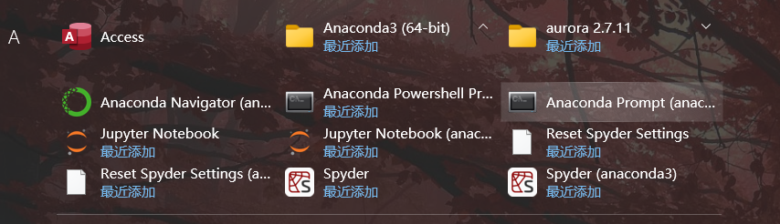

- **查看python版本**

``` c++ 
 python -V / python --version
```

> python 版本取决于待安装的 tensorflow 版本，可根据所需的版本更改 python 版本，自查版本对应关系
>
> `注意:`
>
> 1. 注意 python 版本在不同的 conda 环境下是可以不同的，需要配置指定环境下的 python 版本，此处为 tensorflow_env 环境下的 python 版本

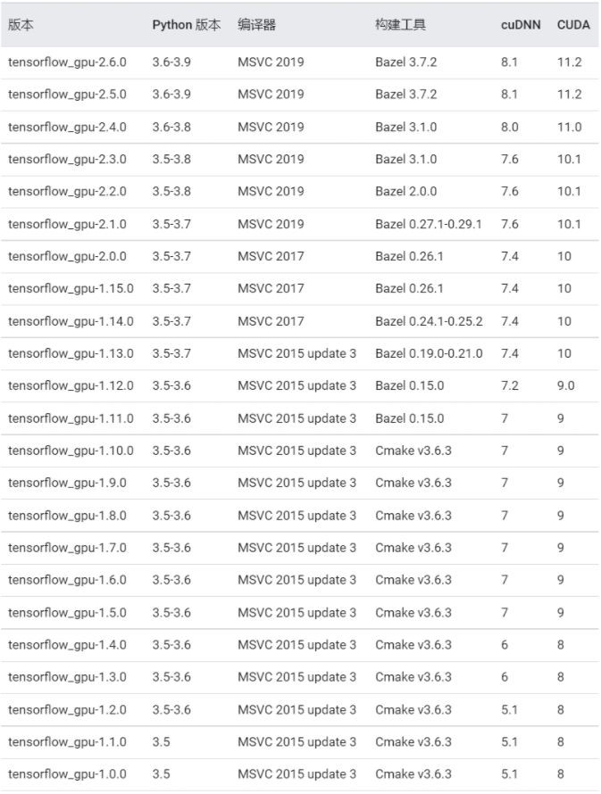

- **创建 Tensorflow_env 环境**

 ```c++
 conda create -n tensorflow_env tensorflow // 创建tensorflow_env环境
 conda activate tensorflow_env //切换至tensorflow_env环境进行配置
 ```

`注意:`

1. Anaconda 默认环境为 base，留意当前配置的环境是否为自己所需的环境
2. 以下的所有环境配置需要切换至 Tensorflow_env 环境后进行
3. Tensorflow_env 环境下默认的 Tensorflow 版本为1.2.1，需要进行升级
4. Tensorflow_env 环境下默认的 pyhon 版本为 3.6.2

## Tensorflow 版本升级

- **更新 python 版本**

  > python 版本与 tensorflow 具有对应关系，若默认python符合要求，略过即可

```c++ 
conda install python=3.x //安装指定python版本
```

- **升级 Tensorflow 版本**

> AIAnimation 所需的 Tensorflow 版本至少为 2.0.0，此处以2.4.0为例

```c++ 
pip install tensorflow==2.4.0 //需要挂VPN
pip install tensorflow-gpu==2.4.0 -i https://mirrors.aliyun.com/pypi/simple/ // 或者使用阿里镜像
```

- **检查 Tensorflow 版本**

  > Anaconda Navigator 下 Environments -> tensorflow_env -> Installed -> tensorflow 可查询到对应的版本，这里为2.0.0

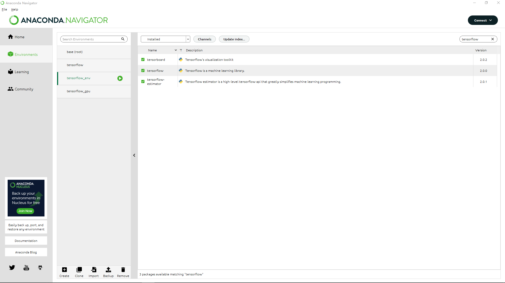

## Pycharm下配置Anaconda环境

- **新建项目 -> Pure Python -> Existing interpreter -> ...选项**

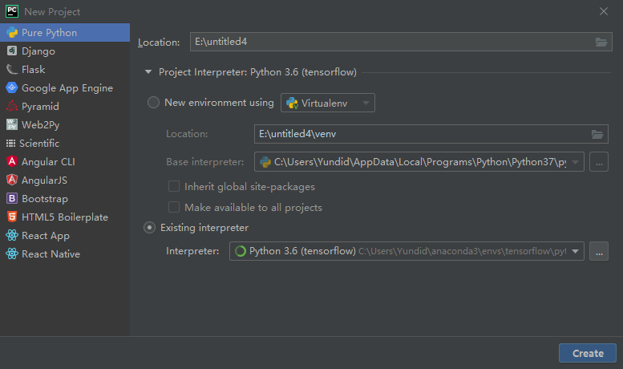

- **Conda Environment -> 配置Interpreter 找到对应配置环境下的 python.exe -> Conda executable 找到Anaconda下的 conda.exe**

> `注意:`
>
> 1. Interpreter 路径在 C:\Users\UserName\anaconda3\envs\\... 下寻找
>
> 2. Conda executable 路径为 C:\Users\UserName\anaconda3\Scripts\conda.exe 即可

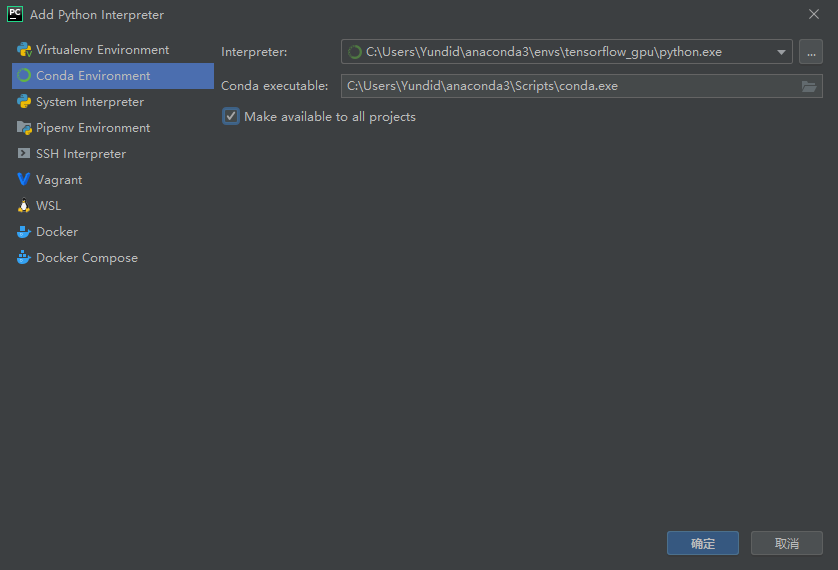


- **创建完成后，配置运行项目的解释器为指定解释器即可**

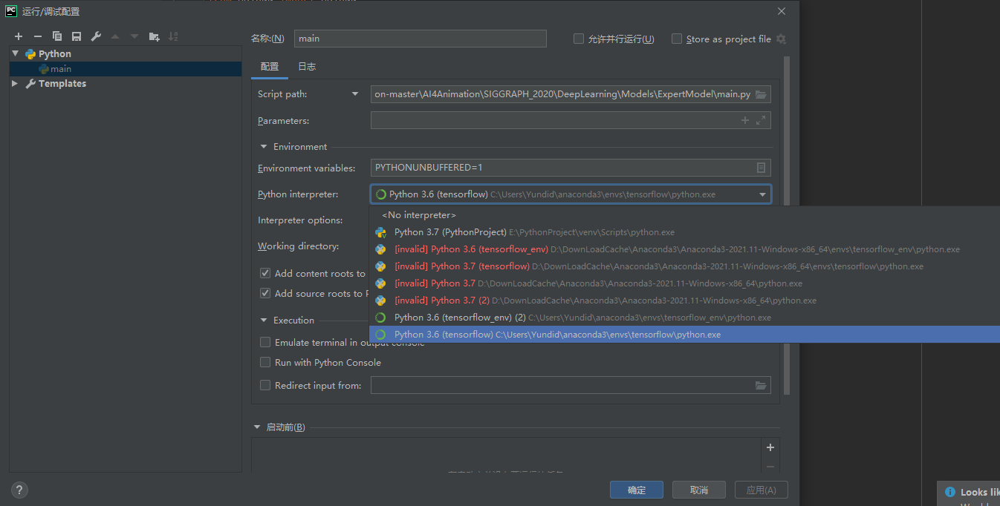
