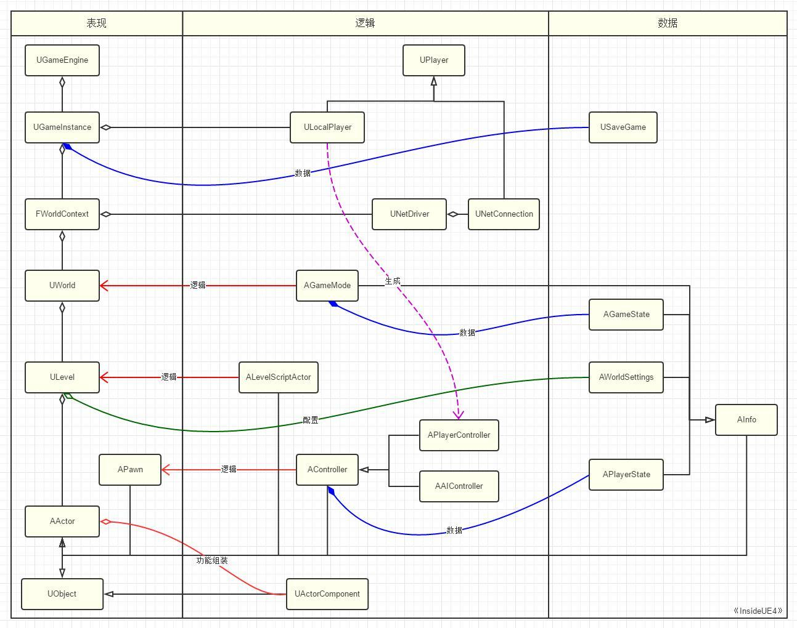
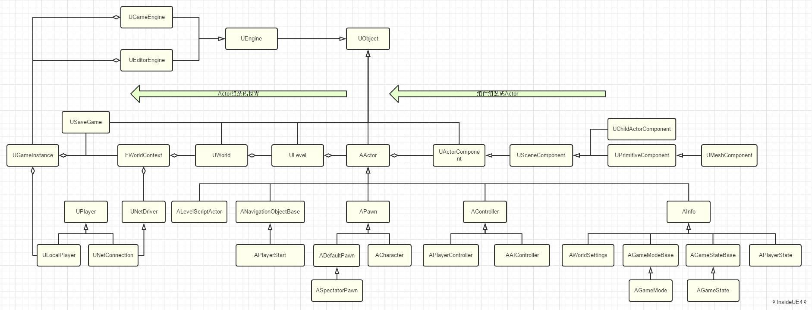

注意: 类体结构以旧版本为主，目前以能看懂源码为主，具体深入到某一个类时，以源码为主！

# -------世界构建-------

# UObject

> 元数据，反射生成，GC垃圾回收，序列化，编辑器可见，Class Default Object.

```
Class UObject ◇-> UClass
-------------
GC / 垃圾回收
MetaData / 元数据
Reflection / 生成
Serialization / 序列化
Editable / 编辑器可见
Class Default Object
-------------
```

# Component / 组件

> Ue 借鉴 Unity 的组件式构建对象的方法，通过 UActorComponent 的派生类来组装 Actor 的各项功能.

## SceneComponent / 场景组件

> Transform 变换仅存放于该组件中.
>
> 仅 SceneComponent 的组件之间可相互嵌套.
>
> `注意:`
>
> 1. AActor::AttachToComponent(...)，通过子组件完成组件父子层级的搭建.
> 2. 一个 Actor 可能包含多个 SceneComponent 组件，需要通过参数指定具体应附加到哪一个插槽，跟随父 Actor 哪一个 SceneComponent 的变换，其本身变换通过在 Location,Roator,Scale上应用 Rule 来计算.

```
Class USceneComponent -> UActorComponent
-------------
USceneComponent* AttachParent;
TArray<USceneComponent*> AttachChildren;
FTransform ComponentToWorld; / 变换
-------------
```

## ActorComponent / Actor 组件

> ActorComponent 仅仅能附加于 Actor 对象下，不能够相互嵌套.
>
> `注意 : `
>
> 1. Ue 更推崇使组件功能单一，不希望出现大管家之类的组件.
> 2. Ue 仍不希望游戏逻辑代码出现在组件中，而 Unity 的脚本作组件挂载.

```
Class UActorComponent -> UObject
-------------
void ReceiveTick(float DeltaSeconds); / 组件 Tick/心跳
-------------
AActor* OwnerPrivate; / 唯一挂载的 Actor
UWorld* WorldPrivate; / 所处的 World
```

## Actor and Component / 关系

> TSet<UActorComponent*> OwnedComponents，Actor 通过集合保存着其在游戏 当前Level 下拥有的所有组件，其中一个组件作 RootComponent，一般为 SceneComponent.
>
> TArray<UActorComponent*> InstanceComponents ，Actor 通过 TArray 保存着所有的实例化组件(创建蓝图类时定义的组件).

# Actor

> Replication / 网络复制，Spwan / 创建销毁，Tick / 心跳.

```
Class AActor -> UObject
-------------
TArray<AActor*> Children; / 父子嵌套
void Tick(float DeltaSeconds); / Tick 心跳
-------------
AActor* Owner;
```

## Actor Hierarchy / 层级

> TArray<AActor*> Children，Actor 中存放了子 Actors 的数组.
>
> `注意:`
>
> 1. AActor::AttachToActor()，通过子 Actor 完成 Actor 父子关系的搭建.

## Tranform / 变换

> 在 Unity 中通过带 transform/变换 的 GameObject 来代表游戏中的对象.
>
> Ue 中的 Actor 不仅仅是3D游戏对象的表述，而还可代表整个世界的运行规则等种种元素，其变换属性封装在 SceneComponent 中，即使是 Actor 的 GetActorLocation,SetActorLocation 等操作 transform 的方法，最终都是转发到 SceneComponent 下执行的.

# Pawn "MVC - V"

> Pawn 强调可被控制的概念，提供了 可被 Controller 控制的接口，由于 Ue 做 Fps 起家，因此还给 Pawn 提供了物理碰撞，基本移动的接口.
>
> `注意:`
>
> 1. Pawn 仅表述了能走，但是怎么走由 Controller 控制，提线木偶的关系.
> 2. Actor 有 InputComponent，但不用于移动逻辑控制，仅用于响应输入，低阶逻辑控制由 Pawn 实现，更高级的由 Controller 实现.

```
Class APawn -> AActor
-------------
TSubclassOf<AController> AIControllerClass;
uint32 bInputEnabled;1;
FVector ControlInputVector;
-------------
APlayerState* PlayerState;
AController* Controller;
```

## ADefaultPawn

> 携带基本逻辑控制能力的 Pawn.

```
Class ADefaultPawn -> APawn -> AActor
-------------
USphereComponent* CollisionComponent; / Pawn 物理碰撞
UPawnMovementComponent* MovementComponent; /Pawn 基本移动
StaticMeshComponent* Mesh; / Pawn显示
-------------
```

## ASpectatorPawn

> 观战玩家也处于地图中，但无需表示，只需提供摄像机的控制能力.

```
Class ASpectatorPawn -> ADefaultPawn -> APawn -> AActor
-------------
USpectatorPawnMovement* MovementComponent; / 无重力漫游
-------------
```

## ACharacter

> 角色移动特化.

```
Class ACharacter -> APawn -> AActor
-------------
USkeletalMeshComponent* Mesh; / 骨架网格体
CharacterMovementComponent* CharacterMovement; / 角色特性移动组件
CapsuleComponent*  CapsuleComponent; / 胶囊体组件
-------------
```

# Level / 关卡

> Level 相当于 Actors 的容器.
>

```
Class ULevel -> UObject
-------------
TArray<AActor*> Actors; / Level 下的所有 Actors
ALevelScriptActor* LevelScriptActor; / 关卡蓝图
TArray<UModelComponent*> ModelComponents; / Level 下的基元 BSP Geometry
-------------
AWorldSettings* WorldSettings(Actors[0]);
```

# World / 世界

> 对所有 Levels 的组装.
>
> `注意:`
>
> 1. 可以以 SubLevel 方式进行组装，也可以以 WorldComposition 方式进行组装.

```
Class UWorld -> UObject
-------------
TArray<ULevel*> Levels; / World 下的所有 Levels
AGameMode* AuthorityGameMode; / 游戏模式
AGameState* GameState; / 游戏状态
UWorldComposition* WorldComposition; / Levels 组合
FPhysScene* PhysicsScene; / 各 Level 共享的全局物理
-------------
ULevel* PersistentLevel; / 主关卡
ULevel* CurrentLevel; / 当前关卡
TArray<ULevelStreaming*> StreamingLevels; / 动态关卡流
UGameInstance* OwningGameInstance; / World 拥有的 GameInstance
TArray<TAutoWeakObjectPtr<AController>> ControllerList;
TArray<TAutoWeakObjectPtr<APlayerController>> PlayerControllerList;
TArray<TAutoWeakObjectPtr<APawn>> PawnList;
```

## PersistentLevel / 主关卡

> 即 World 初始加载的默认关卡，每个关卡均有独立的 WorldSettings，而在 World 范围内起作用的配置项需要以 PersistentLevel / 主关卡 为主.

## EWorldType / World 类型

> World 不仅仅只有一种类型，一个世界也不仅仅只有一个World.

```
namespace EWorldType
{
	enum Type
	{
		None,		// An untyped world, in most cases this will be the vestigial worlds of streamed in sub-levels
		Game,		// The game world
		Editor,		// A world being edited in the editor
		PIE,		// A Play In Editor world
		Preview,	// A preview world for an editor tool
		Inactive	// An editor world that was loaded but not currently being edited in the level editor
	};
}
```

# GameInstance - Game 始末

> 保存当前 World 的 WorldContext，以及其他整个游戏的信息.
>
> `注意:`
>
> 1. 全局的唯一实例，代表着整个游戏的开始与结束.

```
UGameInstance| -> UClass | ◇-> FWorldContext
-------------
ULocalPlayer* CreateLocalPlayer(...); / 创建 Player
AGameModeBase* CreateGameModeForURL(...); / GameMode 的重载修改
-------------
FWorldContext* WorldContext;
TArray<ULocalPlayer*> LocalPlayers; / 管理本地 Player
UOnlineSession* OnlineSession; / 网络会话管理
```

# Engine

> GEngine，源码开始的地方，其引用一个 UEngine.
>
> `注意:`
>
> 1. World 与 Level 的切换的实际发生地是 Engine.

```
Class UEngine
-------------
TIndirectArray<FWorldContext> WorldList; / 所有 World
-------------
```

## UGameEngine

> 一般 GameEngine 下只有一个 WorldContext，直接通过 GameInstance 引用.

```
Class UGameEngine -> UEngine
-------------
UGameInstance* GameInstance;
-------------
```


## UEditorEngine

> 一般有两个 WorldContext，一个用于 EditorWorld，一个用于 PlayWorld / PIE World，通过 WorldContext 下的 GameInstance 间接引用.

```
Class UGameEngine -> UEngine
-------------
UWorld* PlayWorld;
UWorld* EditorWorld;
TArray<FEditorViewportClient*> AllViewportClients;
-------------
```

-----

# -------逻辑控制-------


# WorldContext

> 用于管理跟踪 World 的管理类.
>
> 可以保存切换 World 的过程信息，与目标 World 的上下文信息.
>
> 还保存着 World 下 Level 切换的上下文信息.
>
> `注意:`
>
> 1. WorldContext 可以管理 World 的更替，但是不应由外部直接操作，Ue内部负责.

```
Class FWorldContext ◇-> UWorld
-------------
UGameInstance* OwningGameInstance; / 向上的指针，获取所属的 GameInstance 
UWorld* ThisCurrentWorld; / 当前 World 类型
UGameViewportClient* GameViewport; / 相机相关
-------------
FString TravelURL; / 切换的下一目标 Level
uint8 TravelType; / 切换的下一目标 Level 类型
```

## Level Traveling / 关卡切换

> OpenLevel : 
>
> 先设置当前 World 的 WorldContext 中的 TravelURL，然后在 UEngine::TickWorldTravel 中判断 TravelURL 是否非空来真正执行 Level 的切换.
>
> `注意:`
>
> 1. 关卡切换的信息不存放于 World 中，虽然 LoadStreamLevel 在切换时可以存放于 World 中，但是 World 的 PersistentLevel 在切换时，会将当前 World 释放.

# GameMode / 游戏模式

> World 下的唯一逻辑操纵者.
>
> 一个 World 下只会有一个 GameMode  实例，即PersistentLevel 下的 GameMode.  
>
> `注意:`
>
> 1. 每个 Level 下也存着独立的 GameMode 实例.
> 1. World 下的 GameMode，将通过 Wolrd 的 PersistentLevel 的 AWorldSettings 上的配置生成.

```
Class AGameMode -> AInfo -> AActor
-------------
void InitGame(...); / 初始化游戏
void SetMatchState(...; / 设置游戏运行状态
-------------
FName MatchState; / 游戏运行状态
AGameSession* GameSession; / 游戏会话用于网络联机
AGameState* GameState; / 存储游戏状态
uint32 bUseSeamlessTravel ：1; / 启用无缝切换
```

 ## Responsibility / 职责

1. Class 登记

   > 记录基本的游戏类型信息，用于在需要时通过 UClass 反射可以自动 Spawn 出对象并添加至关卡中. 

2. 控制游戏内实体的 Spawn

   > 包括 玩家，AI 的加载与释放，生成的位置，所处的状态，数目等等.

3. Level 的无缝切换

   > AGameModeBase::bUseSeamlessTravel = true 后可以实现无缝切换.
   >
   > 1. 标记出要在过渡关卡中存留的 Actors
   > 2. 转移至过渡关卡
   > 3. 标记出要在最终关卡中存留的 Actors
   > 4. 转移至最终关卡
   >
   > `注意:`
   >
   > 1. 为避免同时加载两个大地图，则需要引入很小的过渡关卡作中转，减少转换时的资源损耗.
   > 2. 若为设置过渡关卡，则默认创建一个空关卡.

4. 多人游戏的同步

   > 标识整个游戏运行的状态.

## Travelling GameMode / 模式切换

> 在关卡切换时，World 下的 GameMode 也会发生变换.

- 非无缝切换

  > AGameModeBase::bUseSeamlessTravel = false.
  >
  > 新的 World 加载时，当前的 GameMode 将被释放，根据新 World 的配置生成新的 GameMode.

- 无缝切换

  > AGameModeBase::bUseSeamlessTravel = true.
  >
  > CurrentWorld -> TransitionWorld : GameMode 也将被迁移，即 TransitionWorld 下保存着 CurrentWorld 的 GameMode.
  >
  > TransitionWorld -> NewWorld : 根据配置重新生成一个 GameMode.

## GameMode and LevelScriptActor 

> GameMode 更注重整个 World 下，所有 Levels 的通用规则与逻辑，如胜利条件，怪物刷新等.
>
> LevelScriptActor 更注重具体 Level 下表现行为.
>
> GameMode 只在 Sever 中存在(单机游戏也是 Server)，因此对于 Client 的状态与逻辑，GameMode 无法控制，需要通过客户端具体关卡的 LevelScriptActor / 关卡蓝图 中的逻辑控制.

# LevelScriptActor / 关卡蓝图

> 关卡蓝图可包含此关卡下的一些运行规则，提供编写脚本的功能.
>
> `注意:`
>
> 1. Ue 不希望在 LevelScriptActor / 关卡蓝图 中出现太多逻辑代码.
> 2. LevelScriptActor 派生于 AActor，具备挂载组件的功能，但是不允许你挂载组件.

# Controller "MVC - C"

> 控制玩家Pawn的核心逻辑.
>
> `注意:`
>
> 1. Controller 不能够嵌套控制，即不应存在父子嵌套层级.

```
Class AController -> AActor
-------------
void Possess(APawn* InPawn); / 动态选择控制的 Pawn 实例
void UnPossess(); / 动态注销控制的 Pawn 实例
void ChangeState(fName NewState); / 改变 Controller 状态
void InitPlayerState(); / 保存玩家数据
-------------
APlayerState* PlayerState;
uint32 bAttachToPawn;1; / 附加到 Pawn
APawn* Pawn;
ACharacter* Character;
USceneComponent* TransformComponent; / 支持移动
FRotator ControlRotation; / 支持移动
Fname StateName;
```

## Responsibility / 职责

- 关联并控制玩家Pawn

  > `注意:`
  >
  > 1. 不能一个 Controller 同时控制多个 Pawn，只能运行时动态切换 Controller 与 Pawn 的1:1关联，因此即时策略类的游戏不太适合该框架，其需要同时控制多个玩家.

- 自身具备Spawn的能力

  > 由更高的逻辑控制层控制 Controller 的 Spawn.

- 控制 Pawn 的 Spawn

- 保存数据状态

- 在世界中具备位置信息

  > 挂载 SceneComponent 组件.
  >
  > Controller 具有位置信息的意义在于基于其本身的位置信息，可以更高的控制 Pawn 的位置与移动.
  >
  > `注意:`
  >
  > 1. 但是 Controller 自身的位置信息不会自动更新，若需要自动更新，则需要设置 bAttachToPawn 为 true，将 Controller 附加到 Pawn 上，使其跟随 Pawn 的移动.

- 同步

## APlayerController

> 作为玩家控制的实体，具有与玩家相关的操作接口.
>
> 主要负责相机管理，输入逻辑控制，关联UPlayer，显示HUD，Voice语音，Level切换等职责.
>
> `注意:`
>
> 1. APlayerController 可以被替换，一般不同的关卡玩家会关联不同的 APlayerController，来实现不同的控制方式.
> 2. UPlayer : APlayerController : APawn : APlayerState = 1:1:1:1;可切换.

```
Class APlayerController -> AController -> AActor
-------------
void SetPlayer(Uplayer* InPlayer); / 设置所控制的玩家
-------------
UPlayer* Player; / 关联 Player
AHUD* MyHUD; / HUD显示
APlayerCameraManager* PlayerCameraManager; / 控制玩家视角
UPlayerInput* PlayerInput; / 输入处理
APawn* AcknowledgedPawn;
ASpectatorPawn* SpectatorPawn;
```


## AAIController

> AI 也可以算作一个 Player，只是无需接受玩家的控制，AAIController 为 AI 的控制实体.

```
Class AAIController -> AController -> AActor
-------------
...
剔除了APlayerController的基本组件，但新增了一些AI组件
-------------
```

# -------数据存储-------

# SaveGame / 游戏存档

> 玩家存档.
>
> `注意:`
>
> 1. SaveGame 可以看作是一个全局持久的 数据 + 数据业务逻辑 类.
> 2. GameInstance 存临时数据，而 SaveGame 存持久性数据.

```
Class USaveGame -> UObject
```

# GameState / World 配置

> 保存游戏的状态数据，包含整个游戏的状态数据以及所有的 PlayerState.
>
> `注意:`
>
> 1. GameState 在客户端存在，GameMode 下的状态数据可通过 GameState 传递.

```
Class AGameState -> AInfo -> AActor
-------------
void SetMatchState(...); / 同步游戏运行状态
void AddPlayerState(...); / 管理 World 下的 PlayerState
-------------
Fname MatchState;
TArray<class APlayerState*> PlayerArray;
```

## GameSession / 游戏会话

> 针对网络 Session 的一个方便管理的类.

# WorldSettings / 关卡配置

> 存放着与关联 Level 相关的设置.
>
> `注意:`
>
> 1. 若 WorldSettings 关联的 Level 为 World 的 PersistentLevel，则该 WorldSettings 将作为整个 World 的 WorldSettings.

```
Class AWorldSettings -> AInfo -> AActor
-------------
TSubclassOf<class AGameMode> DefaultGameMode; / 用于生成所处 World 下的 GameMode
-------------
Other settings; / 其他关卡下的设置
```

# APlayerState / 玩家配置"MVC - M" 

> 存放关卡范围内的玩家的游玩数据.
>
> `注意:`
>
> 1. 跨关卡的统计数据(SaveGame)，关卡内 Controller 的临时数据，关卡内的其他数据(GameState)，不应该由 APlayerState 保存.
> 2. APlayerState 只为真实的玩家 Player 存在，NPC可读取对应的 APlayerState 作决策，但自身不存在 APlayerState.

```
Class APlayerState -> AInfo -> AActor
-------------
float Score;
int32 PlayerId;
-------------
```

# -------玩家接入-------

# Player - 玩家接入点

> Ue 中 Player 是广泛的概念，本地玩家可以是 Player，联机时的网络连接也可以是 Player.
>
> `注意:`
>
> 1. Player 是比 World 更高一级的存在.
> 2. Ue 并不推荐直接在 Player 中编程，而是将其作为源头，作为玩家接入 World 的起点，构建 GamePlay 机制.

```
Class UPlayer -> UObject
-------------
void SwitchController(APlayerController* PC);
-------------
APlayerController* PlayerController;
int32 CurrentNetSpeed;
```

## ULocalPlayer

> 本地玩家.
>
> 玩家对象的上层就是引擎，GameInstance 中保存着 LocalPlayer 列表.
>
> `注意:`
>
> 1. LocalPlayer 是 PlayerController 产生的源头.
> 2. GamePlay 框架下不写相关逻辑，拓展后可写玩家的相关逻辑.

```
Class ULocalPlayer -> UPlayer -> UObject
-------------
UWorld* GetWorld();
bool SpawnPlayActor(...); / 生成 PlayerController
UGameInstance* GetGameInstance() const;
-------------
UGameViewportClient* ViewportClient;
```


## UNetConnection

> Ue 中一个网络连接也是一个 Player，可提供输入信号的都可以当做 Player.

```
Class UNetConnection -> UPlayer -> UObject
```

**Questions : **

- ~~PlayerState : Player = 1:1 ？~~
- ~~整个框架的上下级管理关系需要梳理出来~~
- ~~BSP 基元组件 与 网格体组件关系？~~
- ~~PersistentLevel 与 CurrentLevel 有什么关系？~~
- ~~Level 下会有自己的 GameMode？？~~
- ~~对 World 的概念不是很理解~~
- ~~OpenLevel 是用于切换 Level ？还是 World ？~~
- ~~UGameViewportClient？？？~~
- ~~硬编码？~~
- RPC调用？？

-------

# Outline View / 大纲视图

## MVC in Ue_GamePlay



## Necessary Class in Ue_GamePlay


